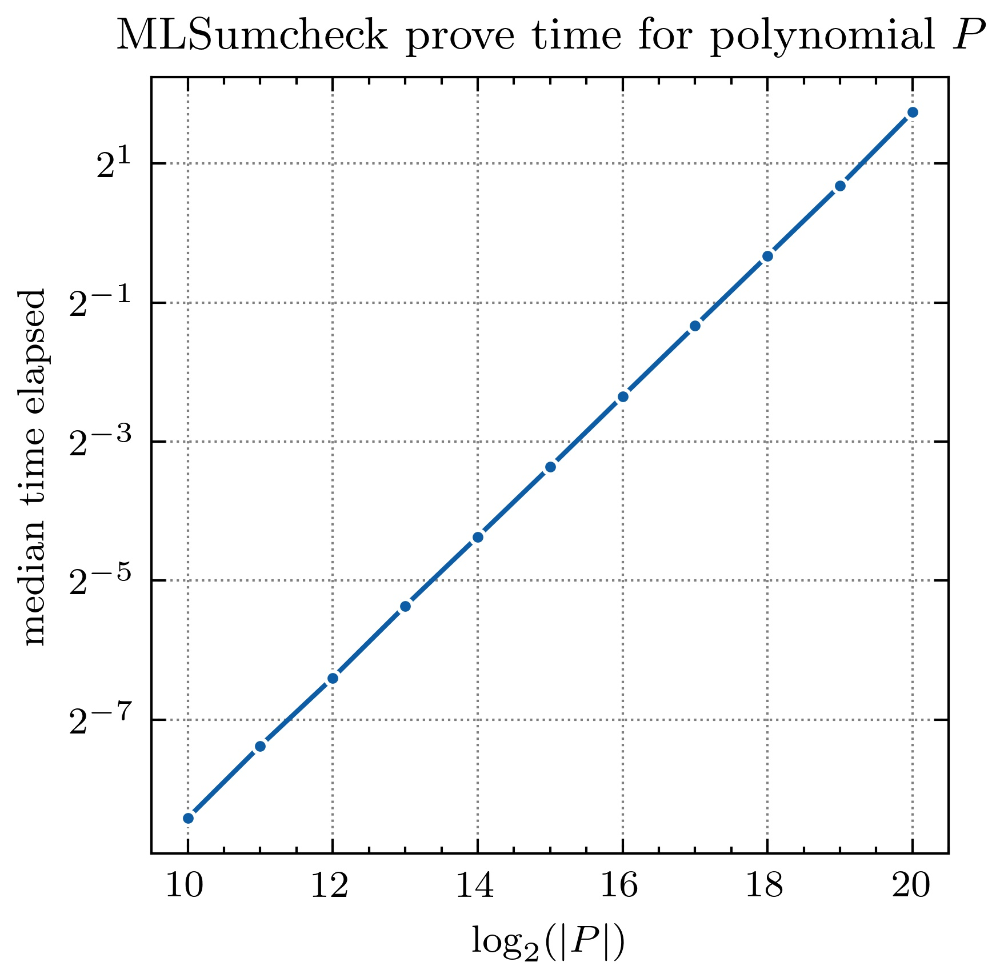
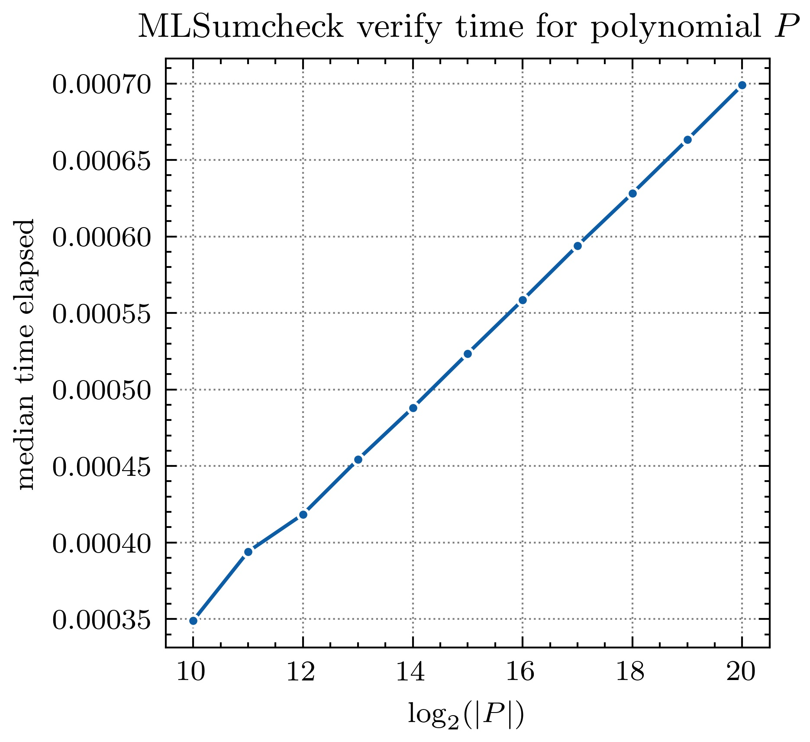
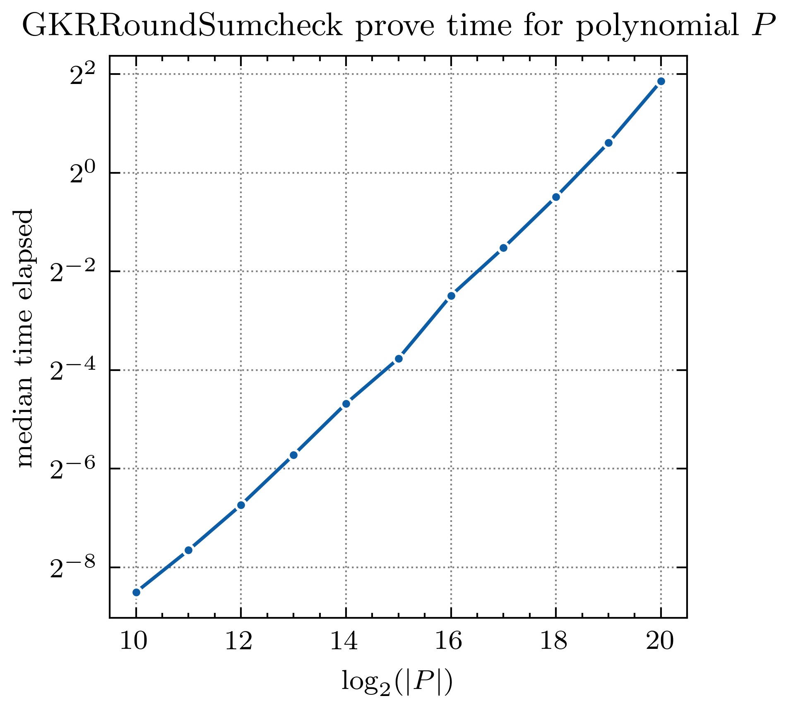
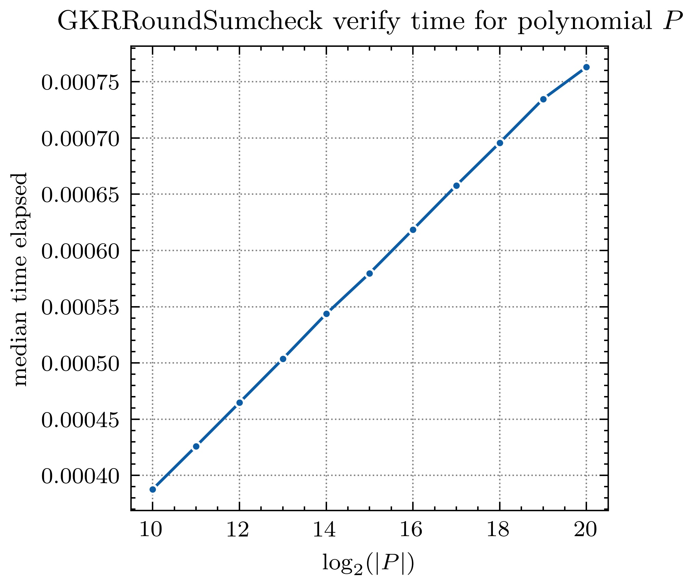

<h1 align="center">Linear-Time Sumcheck</h1>

<p align="center">
<a href="https://github.com/arkworks-rs/sumcheck/actions?query=workflow%3ACI"></a>
    <a href="./LICENSE-APACHE"></a>
   <a href="./LICENSE-MIT"></a>
    <a href="https://deps.rs/repo/github/arkworks-rs/sumcheck/"></a>
</p>


`linear-sumcheck` is a Rust library that implements the sumcheck protocol. 

This crate implements the following protocols: 
- [`MLSumcheck`](src/ml_sumcheck/mod.rs#L18): The sumcheck protocol for 
  products of multilinear polynomials in evaluation form over boolean hypercube.
- [`GKRRoundSumcheck`](src/gkr_round_sumcheck/mod.rs#L83): The sumcheck protocol for GKR Round Function. 
  This protocol takes `MLSumcheck` as a subroutine.

**WARNING**: This is an academic proof-of-concept prototype, and in particular has not received careful code review. This implementation is NOT ready for production use.

## Build guide

The library compiles on the `stable` toolchain of the Rust compiler. To install the latest version of Rust, first install `rustup` by following the instructions [here](https://rustup.rs/), or via your platform's package manager. Once `rustup` is installed, install the Rust toolchain by invoking:
```bash
rustup install stable
```

After that, use `cargo` (the standard Rust build tool) to build the library:
```bash
git clone https://github.com/arkworks-rs/sumcheck.git
cd sumcheck
cargo build --release
```

This library comes with some unit and integration tests. Run these tests with:
```bash
cargo test
```

Lastly, this library is instrumented with profiling infrastructure that prints detailed traces of execution time. To enable this, compile with `cargo build --features print-trace`.

## Benchmarks

To run the benchmarks, install the nightly Rust toolchain, via `rustup install nightly`, and then run the following command:

```shell
cargo +nightly bench --all-features
```

All benchmarks below are performed over BLS12-381 scalar field implemented in the `ark-test-curves` library. Benchmarks were run on a machine with an Intel Xeon 6136 CPU running at 3.0 GHz.

#### Benchmarks for `MLSumcheck`





#### Benchmarks for `GKRRoundSumcheck`





## License

This library is licensed under either of the following licenses, at your discretion.

* [Apache License Version 2.0](LICENSE-APACHE)
* [MIT License](LICENSE-MIT)

Unless you explicitly state otherwise, any contribution that you submit to this library shall be dual licensed as above (as defined in the Apache v2 License), without any additional terms or conditions.

## Reference Paper
[Libra: Succinct Zero-Knowledge Proofs with Optimal Prover Computation](https://eprint.iacr.org/2019/317) <br/>
Tiancheng Xie, Jiaheng Zhang, Yupeng Zhang, Charalampos Papamanthou, Dawn Song

[Time-Optimal Interactive Proofs for Circuit Evaluation](https://arxiv.org/abs/1304.3812) <br/>
Justin Thaler
