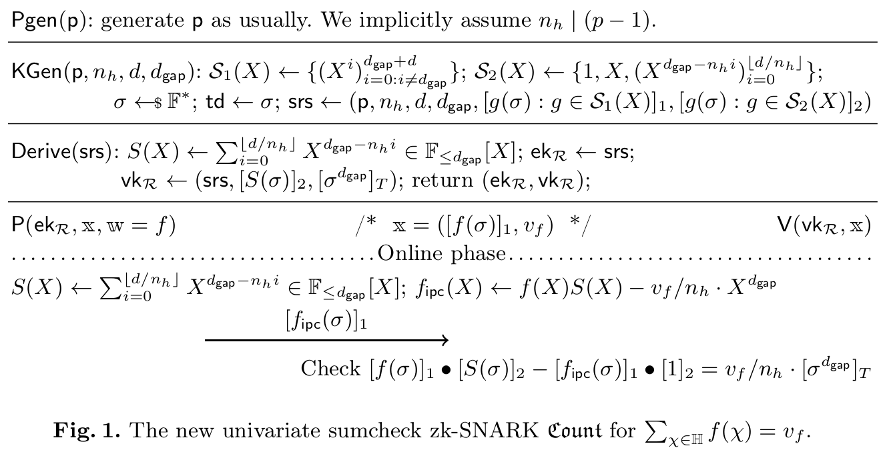

<h1 align="center">Count-Sumcheck</h1>

An Implementation of the Count sumcheck argument for univariate polynomials. 

## Sumcheck Protocol

## Authors
- Michal Zajac <michal@nethermind.io>
- Isaac Villalobos <isaac@nethermind.io>
- Aleksander Misztal <aleksander@nethermind.io>
- Patrick Stiles <patrick.stiles@nethermind.io>

## Reference Paper:

[Counting Vampires: From Univariate Sumcheck to Updatable ZK-SNARK](https://eprint.iacr.org/2022/406)  
Helger Lipmaa, Janno Siim, Michal Zajac

## License:

This library is licensed under either of the following licenses, at your discretion.

* [Apache License Version 2.0](LICENSE-APACHE)
* [MIT License](LICENSE-MIT)

Unless you explicitly state otherwise, any contribution that you submit to this library shall be dual licensed as above (as defined in the Apache v2 License), without any additional terms or conditions.

